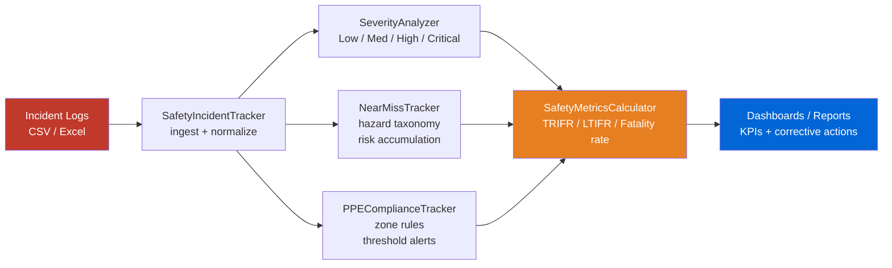

# Mine Safety Incident Tracker


A Python toolkit for tracking mine safety incidents in open-cut coal operations: computes industry-standard KPIs (TRIR/TRIFR, LTIFR, fatality rate, near-miss ratio), classifies incident severity, aggregates hazard frequency by area and shift, and generates prioritized corrective-action recommendations from incident logs.

---

## Features

- **Safety KPI Calculator** — TRIFR, LTIFR, fatality rate, and near-miss ratio (per 1M hours worked)
- **Severity Analysis** — Weighted scoring across Low / Medium / High / Critical tiers
- **Near-Miss Tracking** — Hazard-type taxonomy, cumulative risk scoring, shift-level breakdown
- **PPE Compliance** — Zone-specific PPE rules, daily compliance rate, threshold alerts
- **Corrective Actions** — Auto-prioritized recommendations from recurring hazard patterns
- **Safety Culture Assessment** — Categorical rating (excellent / good / adequate / poor) from KPI thresholds

---

## Quick Start

```bash
git clone https://github.com/achmadnaufal/mine-safety-incident-tracker.git
cd mine-safety-incident-tracker
pip install -r requirements.txt
python3 demo/run_demo.py
```

---

## Usage

### Compute safety KPIs

```python
from safety_metrics import SafetyMetricsCalculator

calc = SafetyMetricsCalculator(
    mine_name="Pit-A North",
    total_hours_worked=850_000,
    fatalities=0,
    lost_time_injuries=3,
    medical_treatments=7,
    near_misses=45,
)
print(calc.analyze())
```

Output:

```
{
  "mine_name": "Pit-A North",
  "total_hours_worked": 850000,
  "fatalities": 0,
  "lost_time_injuries": 3,
  "medical_treatments": 7,
  "near_misses": 45,
  "trifr": 11.76,
  "ltifr": 3.53,
  "fatality_rate_per_1m": 0.0,
  "near_miss_ratio": 15.0,
  "safety_culture": "adequate"
}
```

### Run the incident-tracking demo

```bash
python3 demo/run_demo.py
```

See the captured run below.

---

## Architecture



---

## Demo Output

```
$ python3 demo/run_demo.py
================================================================
  Mine Safety Incident Tracker — Demo
  Site: Pit-A North | Period: Q1 2026
================================================================

Loaded 20 incident records from sample_incidents.csv

Incident Summary:
  Site                  : Pit-A North
  Total events logged   : 20
  Cumulative risk score : 58
  Top hazard type       : Near Collision
  Top location          : Haul Road
  Night shift events    : 30%

Severity Distribution:
  Critical   ████                   4
  High       █████████              9
  Medium     ████                   4
  Low        ███                    3

Hazard Frequency:
  Near Collision            : 5
  Slip/Trip                 : 3
  Falling Object            : 2
  Ground Instability        : 2
  Equipment Malfunction     : 2

Top Recommended Corrective Actions:
  1. [HIGH] Implement traffic management plan at Haul Road: segregate
     haul trucks from light vehicles, add signage at blind spots.
  2. [HIGH] Cumulative risk score exceeds threshold (50). Schedule
     emergency safety stand-down within 48 hours.

PPE Compliance Report (2026-03-11):
  Workers inspected     : 8
  Fully compliant       : 3
  Violations            : 5
  Compliance rate       : 37.5%
  Most missed PPE       : hearing (×4), eye (×4), foot (×1)

  ALERT: Site compliance 37.5% below target 95.0%
  CRITICAL: 4 worker(s) missing high-risk PPE
================================================================
  Demo complete
================================================================
```

---

## Sample Data

A top-level `sample_data.csv` is included with 20 realistic mine-incident rows:

| column | description |
|---|---|
| `incident_id` | Unique identifier (INC-YYYY-NNN) |
| `date` | Incident date (ISO-8601) |
| `mine_site` | Site name (Pit-A North, Workshop, etc.) |
| `type` | Hazard type (Near Collision, Falling Object, ...) |
| `severity` | Low / Medium / High / Critical |
| `hours_lost` | Lost-time hours |
| `cause` | Short root-cause description |
| `corrective_action` | Action taken |

---

## Tech Stack

| Tool | Purpose |
|---|---|
| Python 3.9+ | Core language |
| pandas | Incident data aggregation |
| numpy | Statistical risk calculations |
| matplotlib | Chart rendering |
| rich | Terminal-friendly reports |
| pytest | Unit testing |

---

## Testing

```bash
pytest tests/ -v
```

---

## License

MIT License — see [LICENSE](LICENSE).

---

> Built by [Achmad Naufal](https://github.com/achmadnaufal) | Lead Data Analyst | Power BI · SQL · Python · GIS
