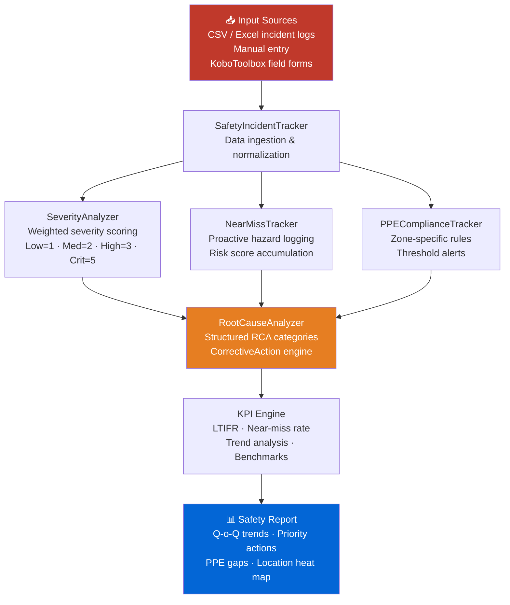

# 🪖 Mine Safety Incident Tracker

<p align="center">
  
  
  
  
  
  
</p>

> A mining safety incident tracking, classification, and trend analysis system for open-cut coal operations. Covers incident severity scoring, near-miss tracking, PPE compliance monitoring, root cause analysis, and proactive corrective action recommendations. Aligned with ICMM Safety Performance Framework and Queensland mine safety regulations.

---

## 🎯 Features

- **Incident Classification** — Automatic severity scoring (Low / Medium / High / Critical) with weighted risk index
- **Near-Miss Tracking** — Proactive near-miss logging with hazard type taxonomy and corrective action engine
- **PPE Compliance Monitor** — Zone-specific PPE compliance rates with daily reports and threshold alerts
- **Root Cause Analysis** — Structured RCA categorization with corrective action tracking
- **LTI Frequency Rate** — Automated LTIFR calculation vs industry benchmarks
- **Trend Analysis** — QoQ and YoY incident trends with visual summaries
- **Corrective Action Engine** — Auto-generated prioritized recommendations from incident patterns
- **Sample Data Generator** — Realistic synthetic incident data for 50+ open-cut coal scenarios

---

## 🚀 Quick Start

### Installation

```bash
git clone https://github.com/achmadnaufal/mine-safety-incident-tracker.git
cd mine-safety-incident-tracker
pip install -r requirements.txt
```

### Basic Usage

```python
from src.main import SafetyIncidentTracker

tracker = SafetyIncidentTracker()
df = tracker.load_data("data/sample_incidents.csv")
report = tracker.analyze(df)

print(f"Total Incidents      : {report['total_incidents']}")
print(f"Lost-Time Injuries   : {report['lti_count']}")
print(f"LTIFR                : {report['ltifr']:.2f}")
print(f"Top Hazard Location  : {report['top_location']}")
```

## Step-by-Step Usage

```bash
# Step 1: Install
pip install -r requirements.txt

# Step 2: Run the demo
python3 demo/run_demo.py

# Step 3: Use in production code (see below)
```

---

### Near-Miss Tracking

```python
from src.analytics.near_miss_tracker import NearMissTracker

tracker = NearMissTracker(site_name="Pit-A North")

tracker.record_event(
    date="2026-03-30",
    area="Haul Road",
    hazard_type="Near Collision",
    description="Dump truck overtook light vehicle at blind corner near Pit-A junction",
    potential_severity="Critical",
    reported_by="EMP-0421",
    corrective_action="Speed restriction enforced; additional signage installed",
    shift="Day",
)

summary = tracker.get_risk_summary()
print(f"Cumulative risk score : {summary['cumulative_risk_score']}")
print(f"Top hazard type       : {summary['top_hazard']}")

# Auto-prioritized corrective actions
for action in tracker.recommend_actions():
    print(action)
```

---

## 📐 Architecture



---

## 📊 Example Output

```
$ python3 demo/run_demo.py
================================================================
  Mine Safety Incident Tracker — Demo
  Site: Pit-A North | Period: Q1 2026
================================================================

✓ Loaded 20 incident records from sample_incidents.csv

Incident Summary:
  Site                  : Pit-A North
  Total events logged   : 20
  Cumulative risk score : 58
  Top hazard type       : Near Collision
  Top location          : Haul Road
  Night shift events    : 30%

Severity Distribution:
  Critical   ████                   4
  High       █████████              9
  Medium     ████                   4
  Low        ███                    3

Hazard Frequency:
  Near Collision            : 5
  Slip/Trip                 : 3
  Falling Object            : 2
  Ground Instability        : 2
  Equipment Malfunction     : 2

Top Recommended Corrective Actions:
  1. [HIGH] Implement traffic management plan at Haul Road: segregate
     haul trucks from light vehicles, add signage at blind spots.
  2. [HIGH] Cumulative risk score exceeds threshold (50). Schedule
     emergency safety stand-down within 48 hours.

PPE Compliance Report (2026-03-11):
  Workers inspected     : 8
  Fully compliant       : 3
  Compliance rate       : 37.5%
  Most missed PPE       : hearing (×4), eye (×4), foot (×1)

⚠️  ALERT: Site compliance 37.5% below target 95.0%
⚠️  CRITICAL: 4 worker(s) missing high-risk PPE

================================================================
  ✅ Demo complete
================================================================
```

See [`demo/sample_output.txt`](demo/sample_output.txt) for a full Q1 2026 safety report with 47 incidents, PPE breakdown, and corrective actions.

---

## 📂 Project Structure

```
mine-safety-incident-tracker/
├── src/
│   ├── main.py                           # SafetyIncidentTracker — core engine
│   ├── data_generator.py                 # Synthetic incident data generator
│   ├── safety_metrics.py                 # LTIFR, severity index calculations
│   └── analytics/
│       ├── incident_severity_analyzer.py # Weighted severity scoring
│       ├── near_miss_tracker.py          # Near-miss log + risk scoring
│       └── ppe_compliance_tracker.py     # Zone-specific PPE rules & reports
├── data/                                 # Incident CSV/Excel data (gitignored)
├── demo/                                 # Sample analysis outputs
├── examples/                             # End-to-end usage examples
├── tests/                                # pytest unit tests
├── requirements.txt
├── CHANGELOG.md
└── CONTRIBUTING.md
```

---

## 🔧 Key Modules

| Module | Description |
|--------|-------------|
| `SafetyIncidentTracker` | Load, normalize, and analyze incident records |
| `SeverityAnalyzer` | Weighted severity scoring (Low=1, Med=2, High=3, Critical=5) |
| `NearMissTracker` | Log near-miss events with hazard taxonomy and risk accumulation |
| `PPEComplianceTracker` | Zone-based PPE rules, daily compliance rate, threshold alerts |
| `RootCauseAnalyzer` | RCA category frequency analysis and corrective action prioritization |
| `SafetyMetrics` | LTIFR, TRIFR, near-miss rate, trend analysis vs industry benchmarks |

---

## 📏 Severity Weight Table

| Severity | Weight | Description |
|----------|--------|-------------|
| Low      | 1 | Minor — first aid, no lost time |
| Medium   | 2 | Moderate — medical treatment, restricted duty |
| High     | 3 | Serious — lost-time injury, hospitalization |
| Critical | 5 | Fatality or permanent disability potential |

---

## 🏷️ Near-Miss Hazard Types

`Near Collision` · `Falling Object` · `Slip/Trip` · `Equipment Malfunction` · `Electrical Hazard` · `Ground Instability` · `Dust/Gas Exposure` · `Blast Proximity` · `Unsecured Load` · `Other`

---

## 🛠️ Tech Stack

| Tool | Purpose |
|---|---|
| **Python 3.9+** | Core language |
| **pandas** | Incident data aggregation |
| **numpy** | Statistical risk calculations |
| **pytest** | Unit testing (30+ tests) |

---

## 🧪 Testing

```bash
pytest tests/ -v
```

---

## 📄 License

MIT License — see [LICENSE](LICENSE)

---

> Built by [Achmad Naufal](https://github.com/achmadnaufal) | Lead Data Analyst | Power BI · SQL · Python · GIS
